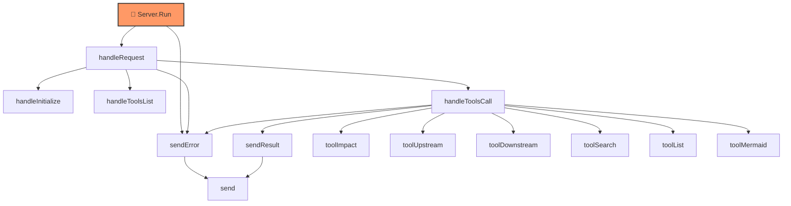
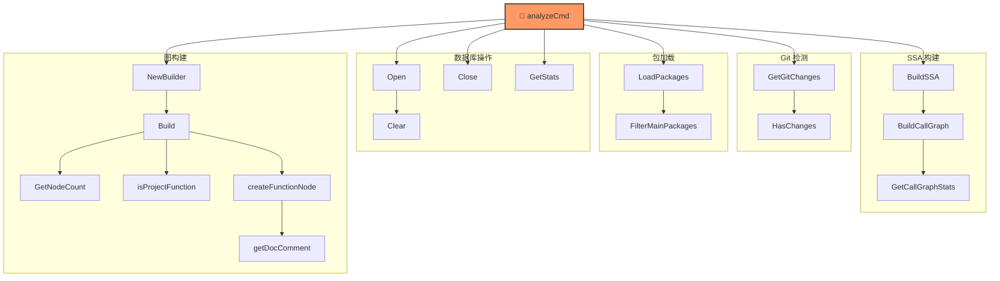
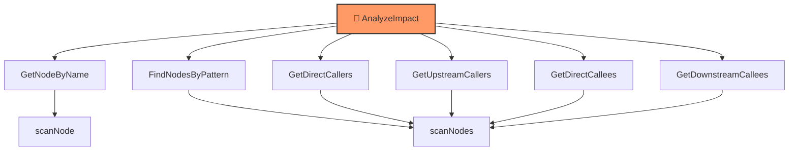

# Code-RAG 项目架构图

## 1. 项目整体架构图

```mermaid
flowchart TB
    subgraph CLI["CLI 命令层"]
        main["main()"]
        analyzeCmd["analyzeCmd"]
        upstreamCmd["upstreamCmd"]
        downstreamCmd["downstreamCmd"]
        impactCmd["impactCmd"]
        listCmd["listCmd"]
        searchCmd["searchCmd"]
        exportCmd["exportCmd"]
        mcpCmd["mcpCmd"]
    end

    subgraph Analyzer["analyzer 分析层"]
        LoadPackages["LoadPackages"]
        BuildSSA["BuildSSA"]
        BuildCallGraph["BuildCallGraph"]
        GetCallGraphStats["GetCallGraphStats"]
        FilterMainPackages["FilterMainPackages"]
        GetGitChanges["GetGitChanges"]
    end

    subgraph Graph["graph 图构建层"]
        NewBuilder["NewBuilder"]
        Build["Build"]
        isProjectFunction["isProjectFunction"]
        createFunctionNode["createFunctionNode"]
        getDocComment["getDocComment"]
    end

    subgraph Impact["impact 影响分析层"]
        NewAnalyzer["NewAnalyzer"]
        AnalyzeImpact["AnalyzeImpact"]
        FormatMarkdown["FormatMarkdown"]
        Summary["Summary"]
    end

    subgraph Export["export 导出层"]
        NewExporter["NewExporter"]
        Export["Export"]
        ExportIncremental["ExportIncremental"]
    end

    subgraph MCP["mcp 服务层"]
        NewServer["NewServer"]
        Run["Run"]
        handleRequest["handleRequest"]
        handleToolsCall["handleToolsCall"]
        toolImpact["toolImpact"]
        toolUpstream["toolUpstream"]
        toolDownstream["toolDownstream"]
        toolSearch["toolSearch"]
        toolList["toolList"]
        toolMermaid["toolMermaid"]
    end

    subgraph Storage["storage 存储层"]
        Open["Open"]
        InsertNode["InsertNode"]
        InsertEdge["InsertEdge"]
        GetNodeByName["GetNodeByName"]
        FindNodesByPattern["FindNodesByPattern"]
        GetDirectCallers["GetDirectCallers"]
        GetUpstreamCallers["GetUpstreamCallers"]
        GetDirectCallees["GetDirectCallees"]
        GetDownstreamCallees["GetDownstreamCallees"]
        GetAllFunctions["GetAllFunctions"]
    end

    main --> analyzeCmd & upstreamCmd & downstreamCmd & impactCmd & listCmd & searchCmd & exportCmd & mcpCmd

    analyzeCmd --> LoadPackages --> BuildSSA --> BuildCallGraph
    analyzeCmd --> GetGitChanges
    analyzeCmd --> NewBuilder --> Build
    Build --> isProjectFunction & createFunctionNode
    createFunctionNode --> getDocComment

    impactCmd & upstreamCmd & downstreamCmd --> NewAnalyzer --> AnalyzeImpact
    AnalyzeImpact --> GetNodeByName & FindNodesByPattern & GetDirectCallers & GetUpstreamCallers & GetDirectCallees & GetDownstreamCallees

    exportCmd --> NewExporter --> Export

    mcpCmd --> NewServer --> Run --> handleRequest --> handleToolsCall
    handleToolsCall --> toolImpact & toolUpstream & toolDownstream & toolSearch & toolList & toolMermaid

    toolImpact --> AnalyzeImpact
    toolUpstream --> GetUpstreamCallers
    toolDownstream --> GetDownstreamCallees
    toolSearch --> FindNodesByPattern
    toolList --> GetAllFunctions
```

## 2. MCP 服务器调用流程图



## 3. 分析流程图 (analyze 命令)



## 4. 影响分析调用图



## 5. 项目模块依赖图

```mermaid
flowchart LR
    subgraph cmd["cmd/crag"]
        main["main.go"]
    end

    subgraph internal["internal/"]
        analyzer["analyzer/"]
        graph["graph/"]
        impact["impact/"]
        export["export/"]
        mcp["mcp/"]
        storage["storage/"]
    end

    main --> analyzer
    main --> graph
    main --> impact
    main --> export
    main --> mcp
    main --> storage

    analyzer --> storage
    graph --> storage
    impact --> storage
    export --> storage
    mcp --> storage
    mcp --> impact
```

---

## 项目说明

这是一个 **Go 代码调用图分析工具 (crag)**，主要功能包括：

| 模块 | 功能 |
|------|------|
| `analyzer` | 使用 SSA 分析 Go 代码，构建函数调用图 |
| `graph` | 将调用图转换为节点和边的数据结构 |
| `storage` | SQLite 数据库存储，支持调用关系查询 |
| `impact` | 分析函数变更的影响范围（上下游调用者） |
| `export` | 导出 Markdown 格式的 RAG 文档 |
| `mcp` | MCP 服务器，允许 AI 助手直接查询调用图 |

