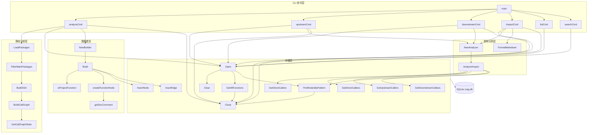
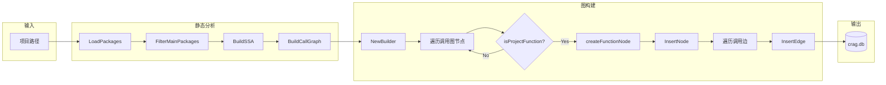
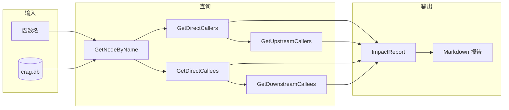

# crag 项目调用图谱 (RAG)

> 自动生成时间: 2026-01-08
> 函数节点数: 47

## 整体架构流程图



## analyze 命令流程图



## impact 命令流程图



---

## 项目结构概览

```
cmd/crag/main.go          # CLI 入口和命令定义
internal/
├── analyzer/             # 静态分析层
│   ├── loader.go         # 包加载
│   ├── ssa.go            # SSA 构建
│   └── callgraph.go      # 调用图构建
├── graph/                # 图数据结构
│   ├── node.go           # 节点定义
│   ├── edge.go           # 边定义
│   └── builder.go        # 图构建器
├── storage/              # 数据持久化
│   ├── schema.sql        # 数据库结构
│   ├── db.go             # 数据库操作
│   └── queries.go        # 查询方法
└── impact/               # 影响分析
    └── analyzer.go       # 影响分析器
```

---

## 调用图谱

### 1. 入口层 (cmd/crag)

#### main()
- **位置**: `cmd/crag/main.go:19`
- **调用**:
  - `analyzeCmd()` → 创建 analyze 命令
  - `upstreamCmd()` → 创建 upstream 命令
  - `downstreamCmd()` → 创建 downstream 命令
  - `impactCmd()` → 创建 impact 命令
  - `listCmd()` → 创建 list 命令
  - `searchCmd()` → 创建 search 命令

#### analyzeCmd$1() - analyze 命令处理函数
- **位置**: `cmd/crag/main.go:51`
- **调用链**:
  ```
  analyzeCmd$1
  ├── analyzer.LoadPackages        # 加载 Go 包
  ├── analyzer.FilterMainPackages  # 过滤有源码的包
  ├── analyzer.BuildSSA            # 构建 SSA
  ├── analyzer.BuildCallGraph      # 构建调用图
  ├── analyzer.GetCallGraphStats   # 获取统计信息
  ├── storage.Open                 # 打开数据库
  ├── (*DB).Clear                  # 清空旧数据
  ├── graph.NewBuilder             # 创建图构建器
  ├── (*Builder).Build             # 构建并存储图
  │   ├── (*Builder).isProjectFunction
  │   └── (*Builder).createFunctionNode
  │       └── (*Builder).getDocComment
  ├── (*Builder).GetNodeCount      # 获取节点数
  └── (*DB).Close                  # 关闭数据库
  ```

#### impactCmd$1() - impact 命令处理函数
- **位置**: `cmd/crag/main.go:261`
- **调用链**:
  ```
  impactCmd$1
  ├── storage.Open
  ├── impact.NewAnalyzer
  ├── (*Analyzer).AnalyzeImpact
  │   ├── (*DB).GetNodeByName
  │   ├── (*DB).FindNodesByPattern
  │   ├── (*DB).GetDirectCallers
  │   ├── (*DB).GetUpstreamCallers
  │   ├── (*DB).GetDirectCallees
  │   └── (*DB).GetDownstreamCallees
  ├── (*ImpactReport).FormatMarkdown
  ├── (*ImpactReport).Summary
  ├── outputJSON
  └── (*DB).Close
  ```

#### upstreamCmd$1() / downstreamCmd$1()
- **位置**: `main.go:134` / `main.go:197`
- **调用**: `storage.Open` → `impact.NewAnalyzer` → `(*Analyzer).AnalyzeImpact` → `(*DB).Close`

#### listCmd$1() / searchCmd$1()
- **位置**: `main.go:304` / `main.go:342`
- **调用**: `storage.Open` → `(*DB).GetAllFunctions` / `(*DB).FindNodesByPattern` → `(*DB).Close`

---

### 2. 分析层 (internal/analyzer)

| 函数 | 位置 | 说明 | 被调用者 |
|------|------|------|----------|
| `LoadPackages` | loader.go:10 | 加载 Go 包 | analyzeCmd$1 |
| `FilterMainPackages` | loader.go:47 | 过滤有源码的包 | analyzeCmd$1 |
| `BuildSSA` | ssa.go:10 | 构建 SSA 表示 | analyzeCmd$1 |
| `GetAllFunctions` | ssa.go:21 | 获取所有函数 | (未使用) |
| `BuildCallGraph` | callgraph.go:12 | 使用 VTA 构建调用图 | analyzeCmd$1 |
| `GetCallGraphStats` | callgraph.go:29 | 获取调用图统计 | analyzeCmd$1 |

---

### 3. 图构建层 (internal/graph)

| 函数 | 位置 | 说明 | 调用 |
|------|------|------|------|
| `NewBuilder` | builder.go:25 | 创建图构建器 | - |
| `(*Builder).Build` | builder.go:59 | 构建并存储节点/边 | isProjectFunction, createFunctionNode |
| `(*Builder).isProjectFunction` | builder.go:50 | 检查是否为项目函数 | - |
| `(*Builder).createFunctionNode` | builder.go:130 | 创建函数节点 | getDocComment |
| `(*Builder).getDocComment` | builder.go:162 | 提取文档注释 | - |
| `(*Builder).GetNodeCount` | builder.go:188 | 获取节点数 | - |

---

### 4. 存储层 (internal/storage)

#### 数据库操作
| 函数 | 位置 | 说明 |
|------|------|------|
| `Open` | db.go:19 | 打开/创建数据库 |
| `(*DB).Close` | db.go:41 | 关闭数据库 |
| `(*DB).Clear` | db.go:46 | 清空数据 |
| `(*DB).Conn` | db.go:52 | 获取底层连接 |

#### 写入操作
| 函数 | 位置 | 说明 |
|------|------|------|
| `(*DB).InsertNode` | queries.go:10 | 插入节点 |
| `(*DB).InsertEdge` | queries.go:23 | 插入边 |

#### 查询操作
| 函数 | 位置 | 说明 | 被调用者 |
|------|------|------|----------|
| `(*DB).GetNodeByName` | queries.go:33 | 按名称查询节点 | AnalyzeImpact |
| `(*DB).GetNodeByID` | queries.go:42 | 按 ID 查询节点 | - |
| `(*DB).FindNodesByPattern` | queries.go:51 | 模糊搜索节点 | AnalyzeImpact, searchCmd$1 |
| `(*DB).GetDirectCallers` | queries.go:64 | 查询直接调用者 | AnalyzeImpact |
| `(*DB).GetDirectCallees` | queries.go:80 | 查询直接被调用者 | AnalyzeImpact |
| `(*DB).GetUpstreamCallers` | queries.go:97 | 递归查询上游调用者 | AnalyzeImpact |
| `(*DB).GetDownstreamCallees` | queries.go:147 | 递归查询下游被调用者 | AnalyzeImpact |
| `(*DB).GetCallEdgesForNode` | queries.go:196 | 查询节点的调用边 | - |
| `(*DB).GetAllFunctions` | queries.go:227 | 查询所有函数 | listCmd$1 |

#### 辅助函数
| 函数 | 位置 | 说明 |
|------|------|------|
| `scanNode` | queries.go:240 | 扫描单个节点 |
| `scanNodes` | queries.go:256 | 扫描多个节点 |

---

### 5. 影响分析层 (internal/impact)

| 函数 | 位置 | 说明 | 调用 |
|------|------|------|------|
| `NewAnalyzer` | analyzer.go:17 | 创建分析器 | - |
| `(*Analyzer).AnalyzeImpact` | analyzer.go:31 | 执行影响分析 | 6 个 DB 查询方法 |
| `(*ImpactReport).FormatMarkdown` | analyzer.go:109 | 格式化为 Markdown | - |
| `(*ImpactReport).Summary` | analyzer.go:175 | 生成摘要 | - |

---

## 数据流向图

```mermaid
flowchart TB
    subgraph Entry [入口]
        main[main.go]
    end

    subgraph Commands [CLI 命令]
        direction LR
        analyze[analyze]
        upstream[upstream]
        downstream[downstream]
        impact[impact]
        list[list]
        search[search]
    end

    subgraph Core [核心模块]
        direction TB
        subgraph analyzer [analyzer 静态分析]
            LoadPackages
            BuildSSA
            BuildCallGraph
        end

        subgraph graph [graph 图构建]
            NewBuilder
            Build
        end

        subgraph impactPkg [impact 影响分析]
            AnalyzeImpact
        end
    end

    subgraph Data [数据层]
        subgraph storage [storage 存储]
            Open
            InsertNode
            InsertEdge
            GetCallers[GetDirectCallers]
            GetCallees[GetDirectCallees]
            GetUpstream[GetUpstreamCallers]
            GetDownstream[GetDownstreamCallees]
        end
        DB[(SQLite crag.db)]
    end

    main --> Commands
    analyze --> analyzer --> graph --> storage
    upstream & downstream & impact --> impactPkg --> storage
    list & search --> storage
    storage --> DB
```

### 模块依赖关系

```mermaid
graph LR
    cmd[cmd/crag] --> analyzer[internal/analyzer]
    cmd --> graph[internal/graph]
    cmd --> impact[internal/impact]
    cmd --> storage[internal/storage]

    graph --> storage
    impact --> storage

    analyzer -.->|使用| tools[golang.org/x/tools]
    storage -.->|使用| sqlite[modernc.org/sqlite]
```

---

## 修改影响速查

| 如果修改... | 需要检查... |
|------------|------------|
| `storage.Open` | 所有 CLI 命令 (6个) |
| `(*DB).InsertNode/Edge` | `(*Builder).Build`, `analyzeCmd$1` |
| `(*Analyzer).AnalyzeImpact` | `impactCmd$1`, `upstreamCmd$1`, `downstreamCmd$1` |
| `(*Builder).Build` | `analyzeCmd$1` |
| `LoadPackages/BuildSSA/BuildCallGraph` | `analyzeCmd$1` |
| `scanNode/scanNodes` | 所有 DB 查询方法 |

