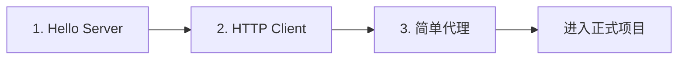

# Hyper 基础学习计划

## 目标

通过 3 个递进的示例，掌握 hyper 的客户端/服务器基本用法。

## 学习路径




## Step 1: Hello World 服务器

在 [src/main.rs](src/main.rs) 中实现一个最简单的 HTTP 服务器：

- 监听端口，接收请求
- 返回 "Hello, World!" 响应
- 学习 `hyper::server`、`Service` trait、`Request`/`Response` 类型

## Step 2: HTTP 客户端

扩展代码，添加一个 HTTP 客户端示例：

- 使用 `hyper::Client` 发送 GET 请求
- 读取响应 body
- 学习 `hyper::client`、连接器、body 流处理

## Step 3: 简单代理原型

将 Server + Client 组合成最简单的代理：

- 接收请求 -> 转发到目标服务器 -> 返回响应
- 这就是 `proxy/service.rs` 的雏形

## 需要更新的文件

1. [Cargo.toml](Cargo.toml) - 添加 hyper、tokio 依赖
2. [src/main.rs](src/main.rs) - 实现示例代码

## 依赖配置

```toml
[dependencies]
hyper = { version = "1.6", features = ["client", "server", "http1"] }
hyper-util = { version = "0.1", features = ["full"] }
tokio = { version = "1", features = ["full"] }
http-body-util = "0.1"

```

## Trait 扩展学习
这种模式叫 newtype delegation 或 blanket impl，在 Rust 生态中非常常见：
```rust
// 一个 impl 语句，让无数类型自动获得方法
impl<T: Body> BodyExt for T {}
impl<B: Body> Body for Request<B> {}
impl<B: Body> Body for Response<B> {}
```

1.BodyExt 扩展了 Body
2.T 实现了 Body，自动为其实现 BodyExt
3.Request<B>的 B 实现了 Body，自动为 Request<B> 实现 BodyExt
